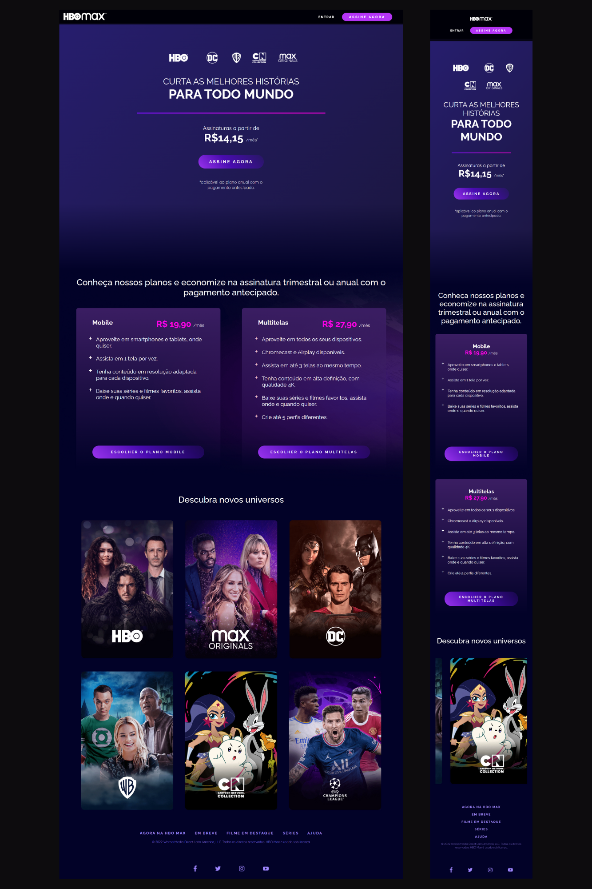
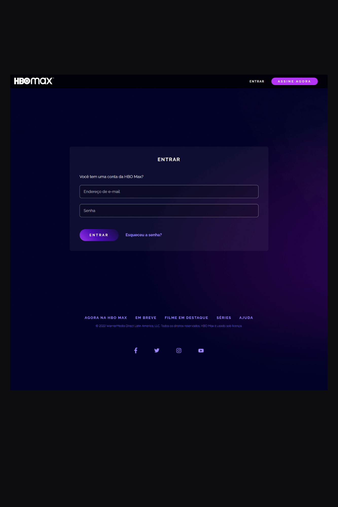
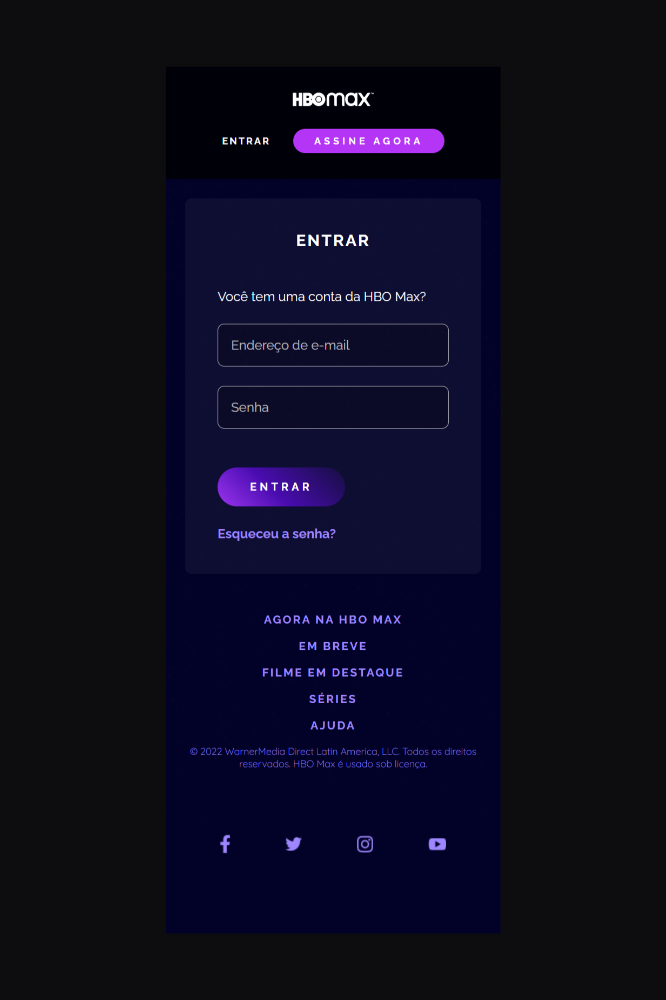

# HBO Max "Clone"

  O projeto é um clone do site <a href="https://www.hbomax.com/br/pt">HBO Max</a>, com o intuito de reproduzir a interface, com algumas modificações, aplicando os temas abordados ao longo das aulas de CSS da plataforma da <a href="https://dio.me">Digital Innovation One</a>.

  O clone do site HBO Max serve como desafio para os alunos da plataforma testarem seus conhecimentos e colocarem em prática os recursos de HTML e CSS abordados nos cursos.

<h2 id="features">Features</h2>

- Menu de navegação
- Cabeçalho com animação gradiente
- Cards com os planos de assinatura animados
- Lista de filmes e séries disponíveis na plataforma
- Formulário de login
- Rodapé com links importantes
- UI Responsiva

*As features são visuais, não possuindo integração com nenhuma API. O intuito do projeto é reproduzir a interface do site original, com algumas modificações.*

<h2 id="topics"> Temas abordados</h2>

O projeto possui como intuito aplicar os conceitos abordados na Trilha de CSS da <a href="https://dio.me">DIO</a>, ministrada pela instrutora <a href="https://github.com/micheleambrosio">Michele Ambrosio</a>.

Recursos CSS presentes no projeto:

- Fundamentos do CSS
- Grid Layout
- Flexbox
- Responsividade
- Pseudo-elementos
- Pseudo-classes
- Transformações 2D e 3D
- Transições e animações
- Tratamento de campos inválidos no formulário

## Resultado
### Home Preview

### SignIn Preview

